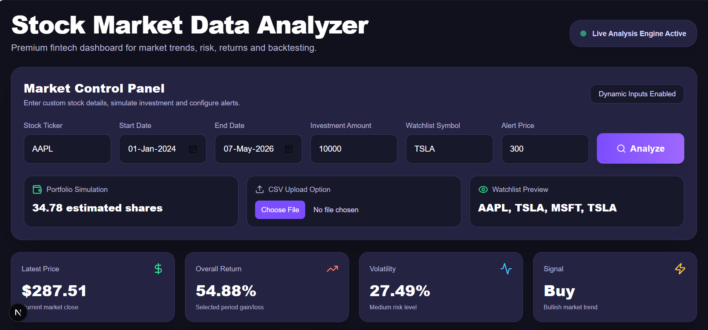
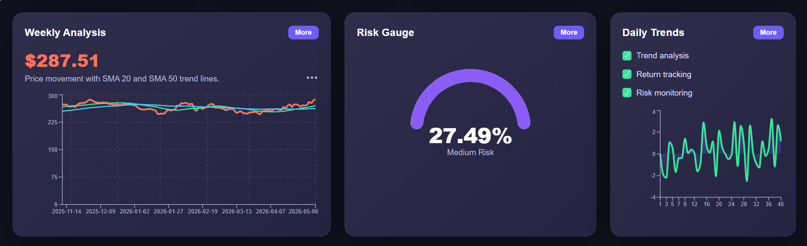
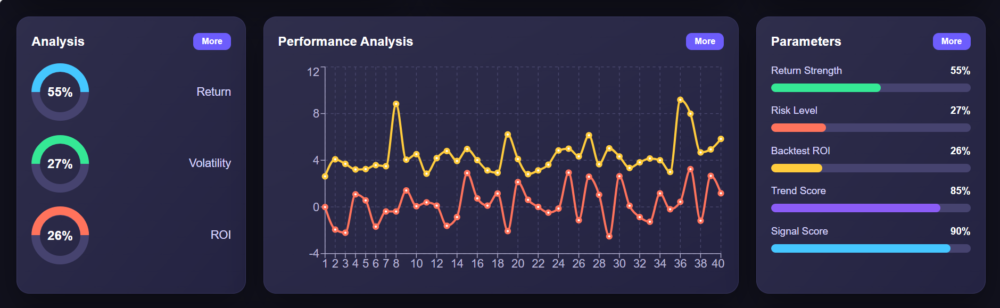
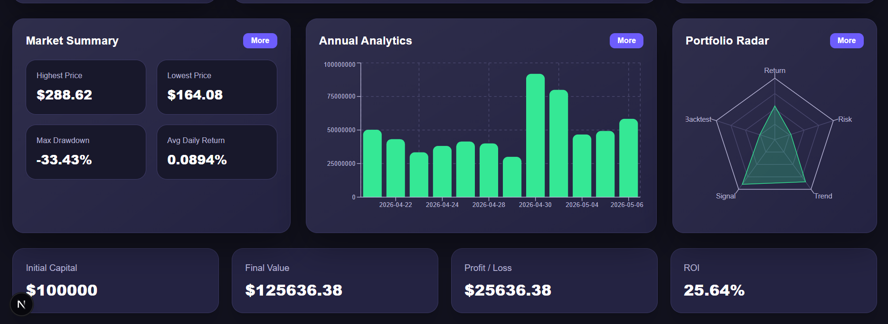

# 📈 Stock Market Data Analyzer

A full-stack AI-driven fintech analytics platform built using **Python, FastAPI, Next.js, Tailwind CSS, Pandas, NumPy, Recharts, and Yahoo Finance data**.

This project analyzes stock market trends, calculates technical indicators, performs risk analysis, runs SMA-based backtesting strategies, generates reports, and visualizes everything through a premium fintech dashboard.

---

# 🚀 Project Overview

The **Stock Market Data Analyzer** helps users analyze historical stock market data using Python and interactive dashboard technologies.

Users can:

- Fetch stock market data
- Analyze stock trends
- Calculate moving averages
- Measure volatility and risk
- Generate Buy/Sell signals
- Run SMA crossover backtesting
- Simulate portfolio investments
- Visualize insights through interactive charts

This project is designed for:

- Python Developer roles
- Data Analyst roles
- Financial Analyst roles
- FinTech internships
- Full-stack developer portfolios

---

# ✨ Features

- 📊 Stock data fetching using Yahoo Finance
- 📈 Technical indicators (SMA, returns, volatility)
- 📉 SMA crossover backtesting
- 📁 CSV & Excel report generation
- 🌐 FastAPI backend
- 💻 Premium Next.js dashboard
- 📊 Interactive charts and analytics
- 📌 Portfolio simulation inputs
- 📉 Risk gauge and market insights
- 🌙 Modern dark fintech UI

---

# 🛠 Tech Stack

## Backend
- Python
- FastAPI
- Pandas
- NumPy
- yfinance
- Matplotlib
- Seaborn

## Frontend
- Next.js
- TypeScript
- Tailwind CSS
- Recharts
- Axios
- Framer Motion

---

# 📁 Folder Structure

```text
Stock-Market-Data-Analyzer/
│
├── backend/
├── frontend/
├── data/
├── outputs/
├── reports/
├── images/
├── docs/
├── main.py
├── requirements.txt
├── README.md
└── .gitignore
```

---

# ⚙️ How It Works

```text
Stock Ticker Input
        ↓
Fetch Stock Data
        ↓
Data Cleaning
        ↓
Technical Analysis
        ↓
Risk & Returns Calculation
        ↓
Backtesting
        ↓
Chart Generation
        ↓
API Response
        ↓
Frontend Dashboard Visualization
```

---

# 🖥️ Installation & Setup

## 1️⃣ Clone Repository

```bash
git clone https://github.com/VaidehiDeore/Stock-Market-Data-Analyzer.git

cd Stock-Market-Data-Analyzer
```

---

## 2️⃣ Create Virtual Environment

### Windows

```bash
python -m venv venv
```

### Activate Environment

```bash
.\venv\Scripts\Activate
```

---

## 3️⃣ Install Dependencies

```bash
pip install -r requirements.txt
```

---

# ▶️ Run Backend

```bash
uvicorn backend.main:app --reload
```

Open API docs:

```text
http://127.0.0.1:8000/docs
```

---

# 💻 Run Frontend

Open another terminal:

```bash
cd frontend

npm install

npm run dev
```

Open dashboard:

```text
http://localhost:3000
```

---

# 📊 Sample Output

```text
Stock: AAPL

Latest Close Price: $287.51
Overall Return: 54.88%
Volatility: 27.49%
Risk Level: Medium
Trend: Bullish
Signal: Buy

Backtest ROI: 25.64%
```

---

# 🖼️ Screenshots

## Main Dashboard



---

## Weekly Analysis



---

## Performance Analysis



---

## Annual Analytics



---

# 📁 Generated Outputs

## Charts

```text
AAPL_price_trend.png
AAPL_moving_average.png
AAPL_daily_returns.png
AAPL_return_distribution.png
AAPL_volume.png
```

## Reports

```text
AAPL_summary_report.csv
AAPL_analysis_report.xlsx
```

---

# 🧠 Key Learnings

Through this project, I learned:

- Financial data analysis using Python
- Working with stock market APIs
- Technical indicator calculation
- Risk and volatility analysis
- API development using FastAPI
- Frontend-backend integration
- Dashboard development using Next.js
- Full-stack fintech application architecture

---

# 🚀 Future Improvements

- Real CSV upload processing
- Candlestick charts
- Multi-stock comparison
- SQLite database integration
- Authentication/login system
- AI-generated insights
- PDF report export
- Real-time watchlists

---

# ⚠️ Disclaimer

This project is created for **educational and portfolio purposes only**.

It does NOT provide financial advice.

Always consult a certified financial advisor before making investment decisions.

---

# 👩‍💻 Author

## Vaidehi Deore

### Technologies Used

```text
Python • FastAPI • Next.js • Tailwind CSS
Pandas • NumPy • Recharts • yfinance
```

---